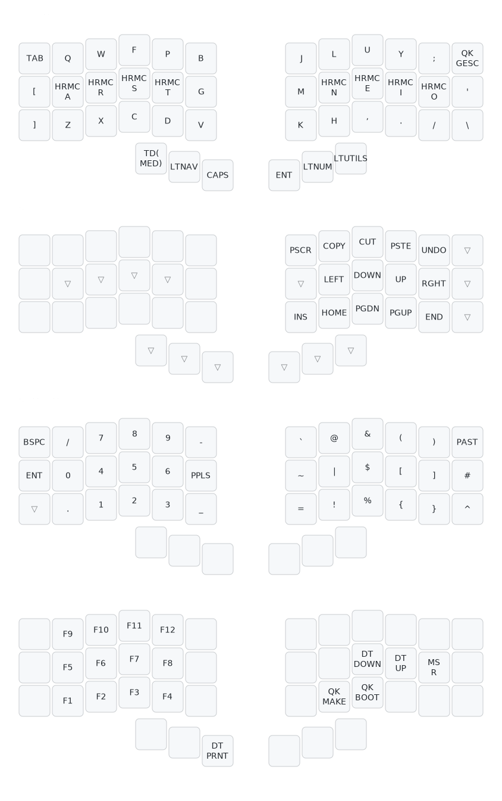

# QMK Configs

This repository contains the configuration files for QMK-powered keyboards.

## Keyboards

#### - Beekeeb/Piantor

  
Keymap

  

## To-do List

- [x] Move Achordion to External Userspace
- [x] Add tapping term per key
- [ ] Add Keymap for Discipline 65
- [x] Fix Achordion same layer issues
- [ ] Add combo keys for commonly used shortcuts in Windows
- [ ] Add macros for Linux
- [ ] Add macros for Kubernetes
